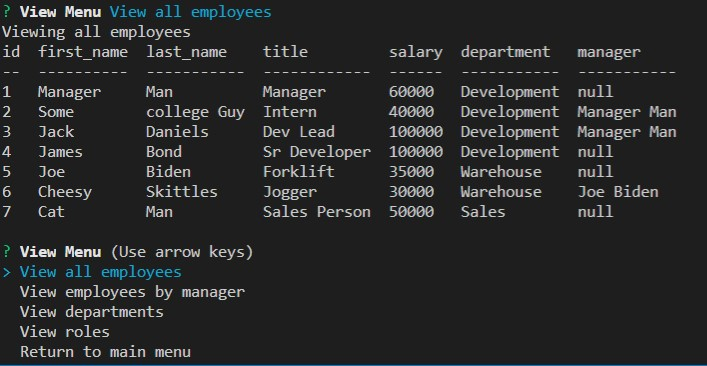
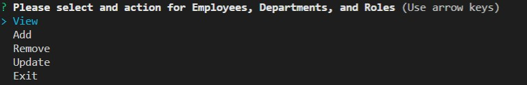
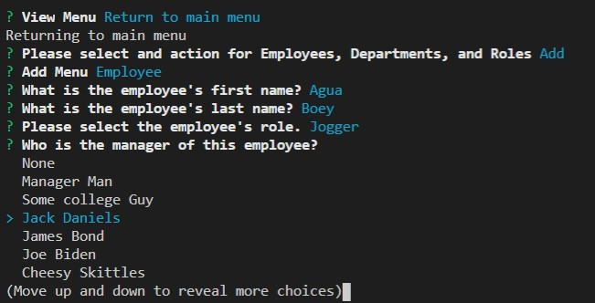

# employee-tracker

Homework12 - Makoto Asahi

Preview Video Link:
-- in progress --

# Description

This app will build an employee database using prompts from the terminal.

The database is responsive to changes to other data within its tables.

> Changes to a department or role will be reflected on all employees under them.

Data is displayed within the terminal in a nice table.

# Installation

This app requires npms `console.table`, `express`, and `mysql2`

They can be installed by running `npm i` in the file directory terminal.

`Node.js`, `MySQL Server`, and `MySQL Workbench` may also be required.

In the db folder, `index.js` must be changed to match the user information.

In the sql folder, `schema.sql` must be run in MySQL Workbench to setup the database tables.

The `seed.sql` file holds sample tables and data to test the database functionaly.

# Usage

Run `node app.js` in the terminal to start this app.

